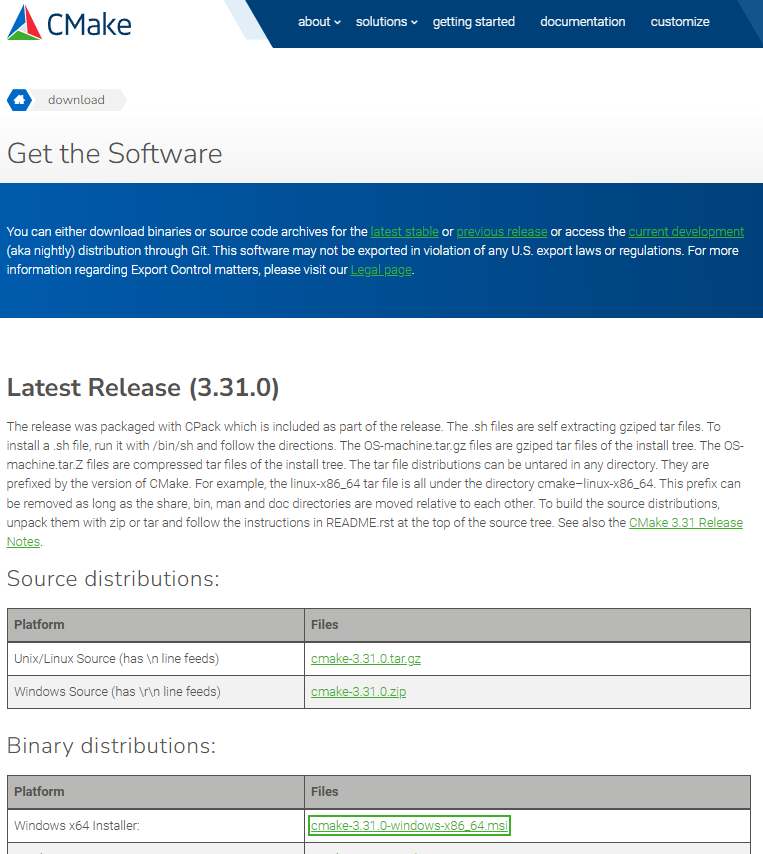
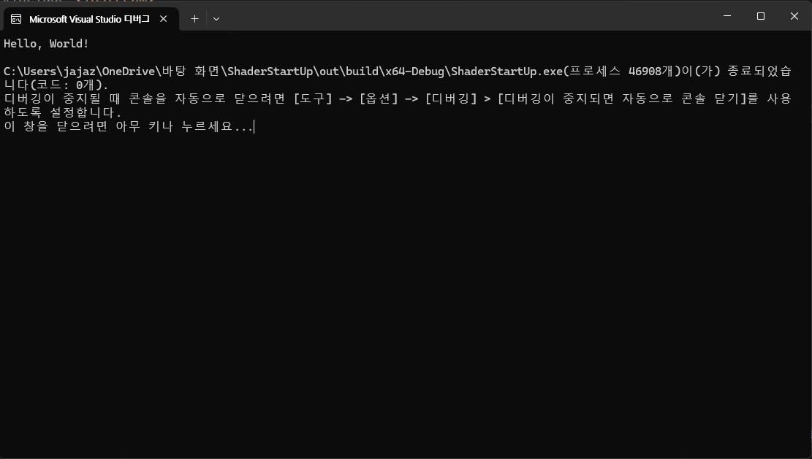
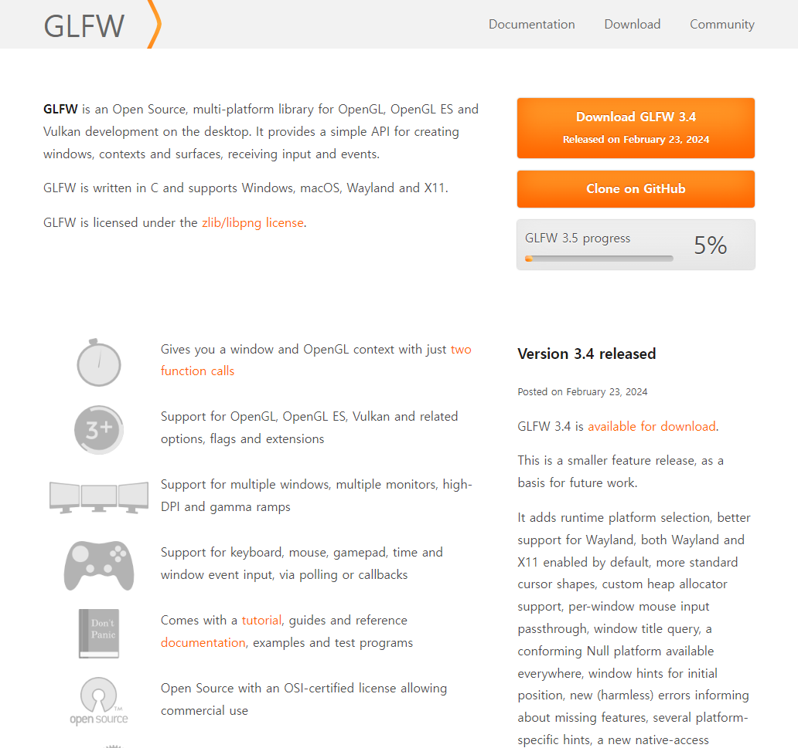
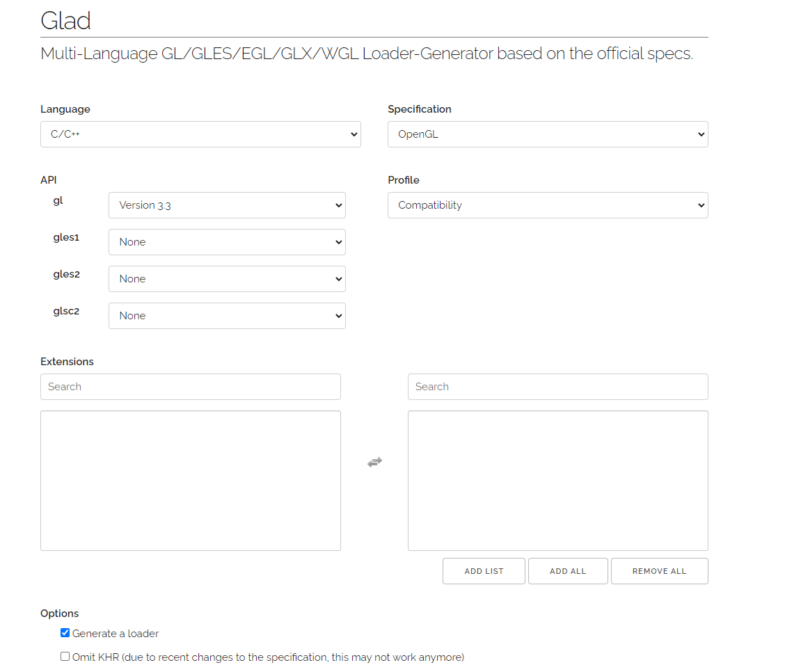
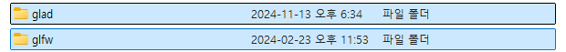
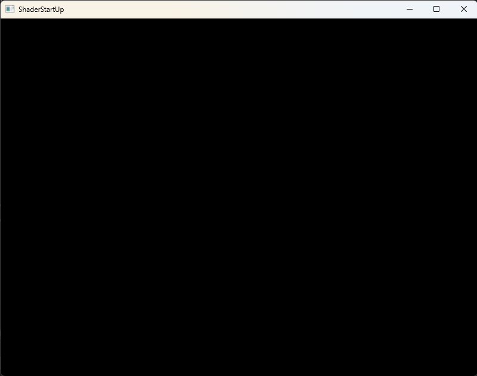
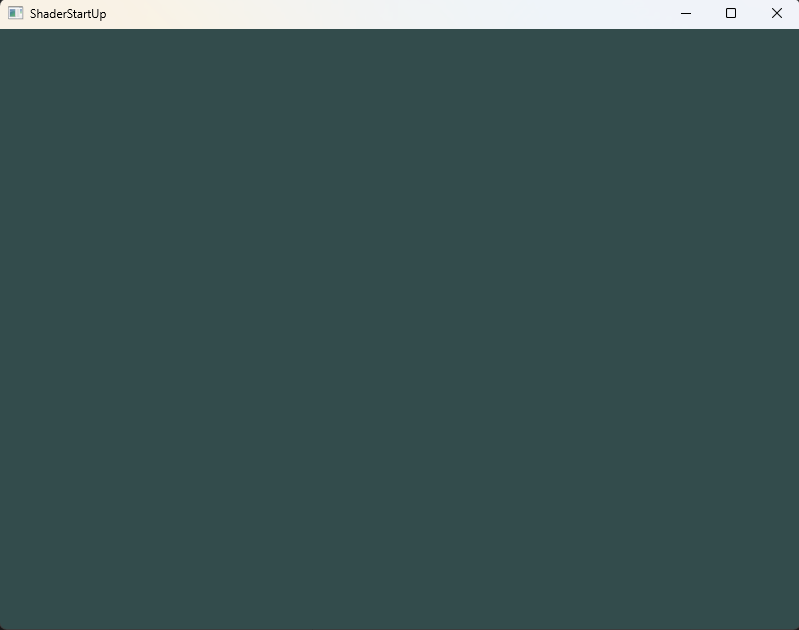

# Shader Start Up

---

## Chapter 1. 쉐이더(Shader)란 무엇인가?

### 1.1 쉐이더(Shader)의 정의

컴퓨터로 그래픽을 그리는 작업은 동그라미, 사각형, 선, 삼각형 등 다양한 모양을 조합하여 최종 결과를 만들어내는 것입니다. 이 작업은 특정 명령어들의 집합으로 이루어지며, 이러한 명령어를 실행하는 것이 **쉐이더**입니다.

**쉐이더**는 **GPU**에서 실행되는 작은 프로그램으로, 그래픽 카드가 화면에 그래픽을 그리는 데 필요한 계산을 수행합니다. 쉐이더는 각 픽셀, 버텍스 또는 기타 그래픽 요소에 대해 실행되는 코드로, GPU가 요소의 색상, 위치, 밝기 등 다양한 시각적 효과를 계산할 수 있게 합니다.

---

### 1.2 왜 쉐이더일까?

CPU를 하나의 큰 공장이라고 생각해 봅시다. 이 공장에는 여러 작업을 처리할 수 있는 **생산 라인(코어)**이 있으며, 각 코어는 독립적으로 여러 작업을 병렬적으로 수행할 수 있습니다.

컴퓨터가 처리해야 할 작업들은 이 생산 라인을 통해 흐르며 각 코어에서 처리됩니다. CPU는 일반적으로 작업을 순차적으로 처리하도록 설계되어 있기 때문에, 한 작업이 끝나야 다음 작업을 시작할 수 있습니다.


대부분의 CPU는 여러 개의 코어를 가지고 있어 동시에 여러 **쓰레드(Thread)**를 처리할 수 있습니다. 예를 들어, 4개의 코어를 가진 CPU는 4개의 작업을 동시에 처리할 수 있으며, 각 코어가 별도의 쓰레드를 실행합니다.

---

### 1.3 GPU의 필요성

하지만 비디오 게임이나 그래픽 응용 프로그램은 CPU의 한계에 부딪힙니다. **3D 모델과 같은 그래픽 요소**는 수많은 픽셀 연산으로 이루어져 있기 때문입니다. 예를 들어, 화면의 모든 픽셀을 개별적으로 계산하고, 특히 3D 게임에서는 각 객체의 위치와 조명 효과까지 계산해야 합니다.

여기서 문제는, **화면의 각 픽셀**이 하나의 작은 연산 작업에 해당하지만, 모든 픽셀에 대해 이러한 연산을 반복해야 한다는 점입니다. 예를 들어, 800x600 해상도의 게임에서는 매 프레임마다 480,000개의 픽셀을 계산해야 하며, 초당 30프레임을 처리하려면 약 14,400,000번의 연산이 필요합니다. 고해상도 화면의 경우 CPU만으로는 이러한 연산을 감당하기 어렵습니다.


이 문제를 해결하기 위해 **병렬 처리(Parallel Processing)**가 필요합니다. 수천 개의 작은 마이크로프로세서를 동시에 작동시켜 수많은 연산을 병렬로 처리하는 장치가 바로 **그래픽 처리 장치(GPU)**입니다.

---

### 1.4 GPU의 작동 방식

GPU는 수천 개의 작은 코어(마이크로프로세서)로 구성되어 있으며, 각 코어는 개별적인 파이프라인처럼 병렬로 작동합니다. 이러한 구조를 **테이블 위에 있는 작은 파이프들**에 비유할 수 있습니다. 각 픽셀 데이터를 작은 공처럼 보고, 이 공을 여러 파이프에 동시에 흘려보내면서 효율적으로 연산을 처리할 수 있습니다.


GPU의 또 다른 강력한 기능은 **하드웨어로 가속된 수학 연산**입니다. 복잡한 수학 연산(예: 삼각 함수, 행렬 연산)을 소프트웨어가 아닌 마이크로칩에서 직접 연산하므로 빠르고 효율적인 계산이 가능합니다. 이를 통해 복잡하고 정밀한 그래픽을 실시간으로 처리할 수 있습니다.

---

## 1.5 쉐이더(Shader)의 종류와 역할

쉐이더는 주로 사용 목적에 따라 다음과 같은 종류로 나뉩니다.

### 1.5.1 버텍스(정점) 쉐이더(Vertex Shader)
- **역할**: 객체를 구성하는 각 정점의 위치와 속성을 처리합니다.
- **작동 방식**: 3D 모델은 정점(Vertex)과 선(Edge)로 구성되는데, 정점 데이터를 받아 화면에 표시될 최종 위치로 변환합니다. 일반적으로 월드 좌표를 화면 좌표로 변환하고, 조명이나 색상 데이터를 추가하여 다음 단계로 전달합니다.

### 1.5.2 지오메트리 쉐이더(Geometry Shader)
- **역할**: 버텍스 쉐이더에서 전달된 정점 데이터를 바탕으로 새로운 도형을 생성하거나 기존 형태를 변형합니다.
- **작동 방식**: 하나의 정점을 여러 정점으로 확장하거나, 기존 도형을 기반으로 다른 형태의 도형을 생성할 수 있습니다.

### 1.5.3 프래그먼트 쉐이더(Fragment Shader)
- **역할**: 화면의 각 픽셀에 대한 색상과 밝기를 계산하여 최종 이미지를 생성합니다.
- **작동 방식**: 픽셀 단위의 데이터를 처리하여 최종 색상을 결정합니다. 텍스처를 입히거나 조명 효과를 계산하는 등 세부적인 색상 정보를 조합해 화면에 표시될 픽셀 값을 출력합니다.

### 1.5.4 컴퓨트 쉐이더(Compute Shader)
- **역할**: 그래픽 렌더링 외의 데이터 연산 작업을 병렬 처리하여 그래픽 성능을 최적화합니다.
- **작동 방식**: 대량 렌더링, 물리 연산, 이미지 처리 등 복잡하고 반복적인 연산을 GPU의 병렬 처리 능력을 활용하여 최적화합니다. 컴퓨트 쉐이더는 그래픽 파이프라인 외부에서도 사용할 수 있어 다양한 비주얼 연산을 지원합니다.

**예시**  
빨간 삼각형을 100,000개 그린다고 가정해보겠습니다.
1. **Vertex Shader**로 삼각형의 위치 좌표를 연산합니다.
2. **Geometry Shader**를 통해 위치 좌표를 기반으로 삼각형 도형을 생성합니다.
3. **Fragment Shader**로 삼각형을 빨간색으로 처리합니다.
4. **Compute Shader**를 사용해 병렬 처리로 100,000개의 삼각형을 빠르게 렌더링합니다.


---

### 1.6 그래픽 쉐이더 프로그래밍 언어

쉐이더를 작성하기 위해 대표적으로 **GLSL**과 **HLSL**이 사용됩니다. 두 언어는 각각 **OpenGL**과 **DirectX** 환경에서 쉐이더 프로그램을 작성하기 위해 설계되었습니다. 이를 통해 프로그래머는 다양한 그래픽 효과를 구현하고, 3D 객체에 사실적인 조명, 텍스처, 그림자와 같은 시각적 효과를 추가할 수 있습니다.

#### 1.6.1 GLSL (OpenGL Shading Language)
**GLSL**은 **OpenGL Shading Language**의 약자로, **OpenGL API**에서 사용하는 쉐이더 프로그래밍 언어입니다. **Khronos Group**에서 개발했으며, Windows, Mac, Linux, Android 등 다양한 운영체제에서 실행 가능한 **크로스 플랫폼 언어**로 설계되었습니다. 이 언어는 주로 게임 개발이나 3D 그래픽 애플리케이션에서 사용되며, OpenGL에서 필요한 그래픽 기능을 쉽게 구현할 수 있도록 도와줍니다.

#### 1.6.2 HLSL (High-Level Shading Language)
**HLSL**은 **High-Level Shading Language**의 약자로, **DirectX API**에서 사용하는 쉐이더 언어입니다. **Microsoft**에서 개발했으며, Windows와 Xbox와 같은 Microsoft 플랫폼에서 최적의 성능을 발휘하도록 설계되었습니다. 특히 Windows 기반의 게임 개발에 널리 사용됩니다.

## Chapter 2. Hello Window

이제 OpenGL을 활용해서 간단하게 Window 창을 띄우는 걸 해볼겁니다. OpenGL은 그래픽 렌더잉을 위한 API로, 기본적으로 그래픽을 출력할 윈도우 창을 직접 생성하지 않습니다. 따라서, GLFW와 GLAD를 통해서 윈도우 창을 생성하고 OpenGL의 확장 함수들을 로딩한 후, CMake를 사용해서 윈도우를 띄우는 간단한 프로그램을 만들어 보겠습니다.

### 2.1 CMake란? 
CMake는 C++ 프로젝트의 빌드 과정을 자동으로 설정해 주는 크로스 플랫폼 빌드 시스템입니다.
CMakeList.txt라는 설정 파일을 통해 프로젝트의 소스 파일, 헤더 파일, 외부 라이브러리 경로 등을 지정할 수 있으며, 이를 기반으로 운영체제와 개발 환경에 맞는 빌드 파일을 생성합니다. Visual Studio에서는 CMake를 통해 ```.sin``` 파일을 생성하지 않아도 C++ 코드를 직접 빌드하고 실행할 수 있습니다.

[CMake 다운로드 사이트](https://cmake.org/download/)



위에 다운로드 링크를 들어가서 Binary distrubutions에 원하는 Platform에 맞는 파일을 다운로드 해줍니다. Window에 경우 Window x64 Installer를 사용해서 다운로드 받으면 됩니다.

#### 2.1.1 CMake 프로젝트 구조
CMake를 사용하여 "Hello World!" 콘솔 프로그램을 만들기 위해 아래와 같은 파일 구조를 구성합니다.

```
ShaderStartUp/
├── CMakeLists.txt          # CMake 설정 파일
└── src/
    └── main.cpp            # C++ 소스 파일
└── include/
    └── main.h              # C++ 헤더 파일
```

---

#### 2.1.2 CMake 설정 파일 작성

프로젝트 루트 디렉토리에 ```CMakeLists.txt``` 파일을 생성한 후, 아래와 같은 내용을 작성합니다.

```
# CMake 최소 요구 버전 설정
cmake_minimum_required(VERSION 3.8)

# 프로젝트 이름 설정
project(ShaderStartUp)

# C++ 표준 설정
set(CMAKE_CXX_STANDARD 17)
set(CMAKE_CXX_STANDARD_REQUIRED True)

# 실행 파일 생성
add_executable(ShaderStartUp src/main.cpp)

```

Visual Studio 2022 버전에서는 해당 ```CMakeLists.txt``` 위에 내용대로 파일이 완성이 되면 자동으로 ```out/bulid``` 디렉토리가 생깁니다.

#### 2.1.3 소스 파일 작성 (main.cpp)
```src``` 폴더에 ```main.cpp``` 파일을 생성하고, 아래와 같이 "Hello, World!" 메시지를 출력하는 코드를 작성합니다.

```
#include <iostream>

int main() {
    std::cout << "Hello, World!" << std::endl;
    return 0;
}

```

이제 ```F5```을 눌러서 ```main.cpp``` 파일을 실행하여 **Hello World**가 나오는 지 확인합니다.




### 2.2 GLFW, GLAD 라이브러리 설치하기

#### 2.2.1 GLFW란?
**GLFW**는 OpenGL을 위한 윈도우 및 입력 관리 라이브러리로, OpenGL 컨텍스트를 생성하고 윈도우를 띄우거나, 키보드와 마우스 입력을 처리하는 기능을 제공합니다. OpenGL 자체는 그래픽을 그리는 API로, 윈도우와 이벤트 관리 기능은 제공하지 않기 때문에, GLFW를 사용해 OpenGL이 동작 할 수 있는 윈도우와 기본적인 인터페이스를 설정하는 것입니다.
- **예시**: OpenGL을 사용해 화면에 삼각형을 그리고 싶다고 가정합니다. OpenGL로는 삼각형을 그리는 함수는 사용할 수 있지만, 삼각형을 띄울 윈도우를 만들 수는 없습니다. 여기서 GLFW가 윈도우를 생성하고, OpenGL이 그릴 수 있는 공간을 마련해 줍니다.

#### 2.2.2 GLAD란?
**GLAD**는 OpenGL의 확장 함수 로더로, 다양한 OpenGL 함수들을 사용할 수 있도록 해줍니다. OpenGL은 다양한 버전마다 추가된 기능과 함수가 다르기 때문에, 직접 사용할려면 버전에 따라 필요한 함수를 미리 로딩하는 과정이 필요합니다. GLAD는 이러한 복잡한 작업을 대신하여 OpenGL 함수를 불러오는 역할을 합니다.
- **예시**: 최신 OpenGL 버전의 특정 함수 (예: glDrawElements)를 사용하고 싶을 때, 해당 함수가 시스템에서 지원하는지 확인하고 로딩해야 합니다. GLAD는 이 과정을 대신해주기 때문에, OpenGL의 다양한 함수를 쉽게 호출할 수 있게 합니다.

#### 2.2.3 GLFW, GLAD 라이브러리 다운로드 

- **GLFW 설치하기**
아래의 링크로 들어가서 다운로드를 받고 압축을 풀어주면 됩니다.

[GLFW 링크](https://www.glfw.org/)



- **GLAD 설치하기**
아래의 링크로 들어가서 
  - Language : C/C++
  - Specification : OpenGL
  - API/gl : Version 3.3

으로 설정하고 맨 아래의 GENERATE 버튼을 클릭하여 다운로드를 받아줍니다.

[GLAD 링크](https://glad.dav1d.de/)



다운로드가 다 되었으면 압축을 풀어주고 각각 ```glfw```, ```glad```로 폴더 이름을 수정해줍니다.




#### 2.2.4 GLFW, GLAD 외부 라이브러리 연동하기 

이제 외부 라이브러리를 폴더를 새로 만들어서 **GLFW**,**GLAD**를 연동하고자 합니다.
외부 라이브러리를 연동할 때에도 ```CMakeLists.txt```를 수정하면 자동으로 빌드가 새로 됩니다.

```external```폴더를 새로 만들어서 방금 전에 다운 받았던 ```glfw```, ```glad```폴더를 이동시켜줍니다.

다음은 디렉토리 구조입니다.

```
ShaderStartUp/         # 프로젝트 루트 폴더
├── CMakeLists.txt            # 최상위 CMake 설정 파일
├── src/                      # 프로젝트의 소스 파일
│   └── main.cpp              # 메인 소스 파일 (파일명은 필요에 따라 변경)
├── include/                  # 프로젝트의 헤더 파일
│   └── main.h                # 헤더 파일 (파일명은 필요에 따라 변경)
├── external/                 # 외부 라이브러리 폴더
│   ├── glfw/                 # GLFW 라이브러리
│   │   ├── include/          # GLFW 헤더 파일
│   │   └── src/              # GLFW 소스 파일
│   └── glad/                 # GLAD 라이브러리
│       ├── include/          # GLAD 헤더 파일
│       │   └── glad.h
│       └── src/              # GLAD 소스 파일
│           └── glad.c
└── out/                      # 빌드 아웃풋 폴더 (빌드된 파일이 생성되는 폴더)

```

위에 구조에 맞추어 ```CMakeLists.txt``` 파일도 수정합니다.

```
# CMakeList.txt : 최상위 CMake 프로젝트 파일, 전역 구성을 수행하고
# 여기에 하위 프로젝트를 포함합니다.
#
cmake_minimum_required (VERSION 3.8)

project ("ShaderStartUp")

# C++ 표준 설정
set(CMAKE_CXX_STANDARD 17)
set(CMAKE_CXX_STANDARD_REQUIRED True)

# OpenGL 라이브러리 찾기
find_package(OpenGL REQUIRED)

# 외부 라이브러리 설정
add_subdirectory(external/glfw)
add_library(glad external/glad/src/glad.c)
target_include_directories(glad PRIVATE external/glad/include)

# 실행 파일 생성 및 소스, 헤더 파일 경로 설정
add_executable(ShaderStartUp src/main.cpp "include/main.h")
target_include_directories(ShaderStartUp PRIVATE include external/glad/include)
target_link_libraries(ShaderStartUp PRIVATE OpenGL::GL glfw glad)

```

이렇게 설정하면 해당 라이브러리를 불러올 수 있습니다. 만약 오류 메세지가 나오면은 Visual Studio에서 ```out```폴더를 삭제하고 다시  ```CMakeLists.txt``` 파일을 저장하면 됩니다. 그래도 오류가 나오면 프로젝트 구조나 이름이 틀리지 않았는지 확인해주시면 됩니다.

이제 ```main.cpp```에서 ```glfw```,```glad``` 헤더파일을 호출합니다.

```
#include <glad/glad.h>       // GLAD의 헤더 파일
#include <GLFW/glfw3.h>      // GLFW의 헤더 파일
#include <iostream>

using namespace std;

int main() {
	std::cout << "Hello World" << std::endl;
	return 0;
}

```
- **주위**
**GLFW 전에 GLAD를 포함해야 합니다. GLAD의 포함 파일에는 필요한 OpenGL 헤더가 백그라운드에 포함되어 있으므로(예: GL/gl.h) OpenGL을 필요로 하는 다른 헤더 파일(예: GLFW) 전에 GLAD를 포함해야 합니다.**


### 2.3 Window 창 띄우기

#### 2.3.1 main함수에서 GLFW 윈도우 생성

[GLFW API 도큐먼트 링크](https://www.glfw.org/docs/latest/intro_guide.html)

```
int main()
{
    glfwInit();
    glfwWindowHint(GLFW_CONTEXT_VERSION_MAJOR, 3);
    glfwWindowHint(GLFW_CONTEXT_VERSION_MINOR, 3);
    glfwWindowHint(GLFW_OPENGL_PROFILE, GLFW_OPENGL_CORE_PROFILE);
    return 0;
}
```

```main```함수에서 먼저 ```glfwInit```함수를 통해 GLFW를 초기화합니다. 이후 ```glfwWindowHint```를 사용해 GLFW 설정을 지정합니다. 첫 번쨰 인수는 설정 옵션을 나타내고, 두 번쨰 인수는 해당 옵션에 지정할 값을 의미합니다.

여기에서는 OpenGL 3.4 버전을 사용하기 때문에, ```GLFW_CONTEXT_VERSION_MAJOR```와 ```GLFW_CONTEXT_VERSION_MINOR```를 각각 3으로 설정하여 OpenGL 3.4버전에서 실행되도록 합니다. 또한 ```GLFW_OPENGL_PROFILE```를 ```GLFW_OPENGL_CORE_PROFILE```로 설정해 최신 OpenGL 기능을 사용할 수 있도록 지정합니다. Mac OS X의 경우, ```glfwWindowHint(GLFW_OPENGL_FORWARD_COMPAT, GL_TRUE);```를 추가해주어야 합니다.

#### 2.3.2 윈도우 객체 생성

윈도우 객체는 OpenGL 컨텍스트와 윈도우 데이터를 포함하며, 대부분의 GLFW 함수에서 필요합니다.

```
GLFWwindow* window = glfwCreateWindow(800, 600, "LearnOpenGL", NULL, NULL);
if (window == NULL)
{
    std::cout << "Failed to create GLFW window" << std::endl;
    glfwTerminate();
    return -1;
}
glfwMakeContextCurrent(window);

```

```glfwCreateWindow``` 함수는 윈도우의 폭, 높이, 이름을 지정하고 나머지 인수는 NULL로 설정합니다. 이후 반환된 ```GLFWwindow``` 객체를 통해 윈도우와 관련된 모든 작업을 수행합니다. 또한 ```glfwMakeContextCurrent```를 호출해 생성한 윈도우 컨텍스트를 현재 스레드의 주요 컨텍스트로 만듭니다.

#### 2.3.3 GLAD 초기화

OpenGL 함수를 호출하기 위해 GLAD를 초기화해야 합니다.
```
if (!gladLoadGLLoader((GLADloadproc)glfwGetProcAddress))
{
    std::cout << "Failed to initialize GLAD" << std::endl;
    return -1;
}
```

GLAD 초기화는 ```gladLoadGLLoader``` 함수를 사용하여 수행하며, ```glfwGetProcAddress```를 전달하여 운영체제에 맞는 OpenGL 함수 주소를 로드합니다.

#### 2.3.4 뷰포트(Viewport) 설정
OpenGL의 뷰포트는 화면에 렌더링되는 영역을 정의합니다.
```
glViewport(0, 0, 800, 600);

```

```glViewport```의 첫 번째와 두 번쨰 매개변수는 위도우의 좌측 하단의 위취를, 세번째와 네번째 매게변수는 윈도우의 너비와 높이를 지정합니다.
화면 좌표는 OpenGL에서 -1에서 1사이로 변환되며, 윈도우의 픽셀 크기로 매핑됩니다.

#### 2.3.5 윈도우 크기 조정 콜백 함수 등록

윈도우 크리가 변경될 떄마다 뷰포트를 조정하기 위해 콜백 함수를 등록할 수 있습니다.

```
void framebuffer_size_callback(GLFWwindow* window, int width, int height)
{
    glViewport(0, 0, width, height);
}
glfwSetFramebufferSizeCallback(window, framebuffer_size_callback);
```
```framebuffer_size_callback``` 함수는 새로운 윈도우 크기에 맞게 뷰포트를 재설정하며, ```glfwSetFramebufferSizeCallback``` 함수를 통해서 콜백을 등록합니다. 윈도우가 처음 표시될 때도 콜백 함수가 호출됩니다.

#### 2.3.6 렌더 루프 생성

응용 프로그램이 윈도우를 띄운 후 종료될 떄까지 계속 실행되는 렌더 루프를 생성합니다. 이 루프는 윈도우가 열려 있는 동안 지속적으로 실행되며, 응용 프로그램이 종료될 때까지 화면을 갱신합니다.

```
while(!glfwWindowShouldClose(window))
{
    glfwSwapBuffers(window);
    glfwPollEvents();
}
```

```glfwWindowShouldClose```는 윈도우가 닫혀야 하는 지를 확인하고, ```glfwPollEvents```는 키보드 및 마우스 입력 같은 이벤트들을 처리합니다. ```glfwSwapBuffers```는 이중 버퍼링을 사용해서 현재 프레임의 색상을 버퍼에 교체하여 화면에 표기합니다.

- **이중 버퍼링(Double Buffering)**
이중 버퍼링은 깜빡임 없이 부드러운 화면을 표시하기 위해서 사용하는 기법입니다. OpenGL에서 화면을 그릴 때, **전면 버퍼(front buffer)**와 **후면 버퍼(back buffer)**라는 두 개의 버퍼를 사용합니다.
  - **후면 버퍼**는 현재 프레임을 그리고 있는 버퍼입니다.
  - **전면 버퍼**는 다음 프레임을 미리 그리는 버퍼입니다.
이렇게 두 가지의 버퍼를 사용하면서, 후면 버퍼에서 다음에 그릴 프레임이 완전히 그려지고 나서 전면 버퍼와 교체하므로, 화면 전환이 부드럽고 깜빡임이 발생하지 않습니다. OpenGL에서는 이중 버퍼링을 사용하여 화면 갱신을 구현합니다.

- **단일 버퍼링(Single Buffering)**
단일 버퍼링은 후면 버퍼없이 전면 버퍼로만 화면을 그리는 기법입니다. 화면이 즉시 표시되므로 프레임이 그려기는 과정이 화면에 그대로 나타나 깜박임 현상나 불완전한 화면이 보일 수 있습니다. 현재 OpenGL에서는 사용하지 않는 기법입니다.

#### 2.3.7 렌더 루프 종료 후 리소스 정리

렌더 루프가 종료되면 OpenGL과 GLFW가 사용한 **메모리 및 시스템 리소스를 해제**해야 합니다. 이를 ```glfwTerminate()``` 함수를 호출하여 GLFW에서 할당한 모든 리소스를 정리합니다.
```
// 렌더 루프 종료 후 리소스 정리
glfwTerminate();
return 0;
```
- **주의** : 
응용 프로그램이 종료될 때마다 반드시 호출해야 합니다. 그렇지 않으면 시스템 리소스가 그대로 남아 있을 수 있습니다.




#### 2.3.8 입력 처리
GLFW의 ```glfwGetKey``` 함수를 사용해 특정 키 입력을 처리할 수 있습니다. 예를 들어, ```ESC``` 키를 눌렀을 때 프로그램을 종료하도록 설정합니다.

```aiignore
void processInput(GLFWwindow* window)
{
	if(glfwGetKey(window,GLFW_KEY_ESCAPE) == GLFW_PRESS)
	{
		glfwSetWindowShouldClose(window, true);
	}
}
```
```aiignore
while (!glfwWindowShouldClose(window))
{
    processInput(window);

    glfwSwapBuffers(window);
    glfwPollEvents();
}
```
매 프레임마다 ```processInput``` 함수를 호출하여 ```ESC``` 키가 눌렸는지 확인하고, 눌렸다면 ```glfwSetWindowShouldClose``` 함수를 호출해 윈도우를 닫습니다.


#### 2.3.9 렌더링

모든 렌더링 명령은 렌더 루프(render loop) 안에서 실행됩니다. 렌더 루프 내에서 렌더링을 수행하면서 화면을 지속적으로 업데이트하고, 사용자 입력을 반영하며, 애니메이션이나 움직임을 부드럽게 보여줄 수 있기 떄문입니다.

```
// 렌더링 루프
while(!glfwWindowShouldClose(window))
{
    // 입력
    processInput(window);

    // 렌더링 명령 함수
    ...

    glfwPollEvents();
    glfwSwapBuffers(window);
}
```

먼저 간단하게 윈도우 화면을 지정한 색상으로 변경하는 렌더링 과정을 진행합니다. 화면을 갱신할 때 **이전 프레임의 잔상**을 없애기 위해 초기화 작업이 필요합니다. OpenGL에서는 ```glClearColor```와 ```glClear``` 함수를 사용해서 화면을 초기화하고, 원하는 생상으로 덮어씌울 수 있습니다.

```aiignore
glClearColor(0.2f, 0.3f, 0.3f, 1.0f);
glClear(GL_COLOR_BUFFER_BIT);
```
- ```glClearColor```는 화면 초기화 색상을 설정합니다. 위 코드에서는 ```R:0.2```, ```G:0.3```, ```B:0.3```, ```A:1.0```의 값으로 설정하여 짙은 청록색 배경을 지정합니다.
- ```glClear``` 함수는 ```GL_COLOR_BUFFER_BIT```를 전달받아 색상 버퍼를 초기화합니다. 이로써, 설정된 ```glClearColor```의 색상으로 화면이 덮어쓰여 이전 프레임의 잔상이 제거됩니다.

이러면 렌더 루프는 화면을 매 프레임마다 초기화 색상으로 덮어씌워 주며, 사용자의 입력과 렌더링 작업을 부드럽게 수행해 줍니다.


