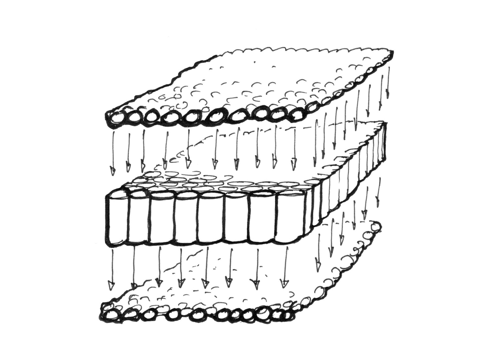

# Shader Start Up

---

## Chapter 1. 쉐이더(Shader)란 무엇인가?

### 1.1 쉐이더의 정의

컴퓨터로 그래픽을 그리는 작업은 동그라미, 사각형, 선, 삼각형 등 다양한 모양을 조합하여 최종 결과를 만들어내는 것입니다. 이 작업은 특정 명령어들의 집합으로 이루어지며, 이러한 명령어를 실행하는 것이 **쉐이더**입니다.

**쉐이더(Shader)**는 **GPU**에서 실행되는 작은 프로그램으로, 그래픽 카드가 화면에 그래픽을 그리는 데 필요한 계산을 수행합니다. 쉐이더는 각 픽셀, 버텍스 또는 기타 그래픽 요소에 대해 실행되는 코드로, GPU가 요소의 색상, 위치, 밝기 등 다양한 시각적 효과를 계산할 수 있게 합니다.

---

### 1.2 왜 쉐이더일까?

CPU를 하나의 큰 공장이라고 생각해 봅시다. 이 공장에는 여러 작업을 처리할 수 있는 **생산 라인(코어)**이 있으며, 각 코어는 독립적으로 여러 작업을 병렬적으로 수행할 수 있습니다.

컴퓨터가 처리해야 할 작업들은 이 생산 라인을 통해 흐르며 각 코어에서 처리됩니다. CPU는 일반적으로 작업을 순차적으로 처리하도록 설계되어 있기 때문에, 한 작업이 끝나야 다음 작업을 시작할 수 있습니다.

대부분의 CPU는 여러 개의 코어를 가지고 있어 동시에 여러 **쓰레드(Thread)**를 처리할 수 있습니다. 예를 들어, 4개의 코어를 가진 CPU는 4개의 작업을 동시에 처리할 수 있으며, 각 코어가 별도의 쓰레드를 실행합니다.

---

### 1.3 GPU의 필요성

하지만 비디오 게임이나 그래픽 응용 프로그램은 CPU의 한계에 부딪힙니다. **3D 모델과 같은 그래픽 요소**는 수많은 픽셀 연산으로 이루어져 있기 때문입니다. 예를 들어, 화면의 모든 픽셀을 개별적으로 계산하고, 특히 3D 게임에서는 각 객체의 위치와 조명 효과까지 계산해야 합니다.

여기서 문제는, **화면의 각 픽셀**이 하나의 작은 연산 작업에 해당하지만, 모든 픽셀에 대해 이러한 연산을 반복해야 한다는 점입니다. 예를 들어, 800x600 해상도의 게임에서는 매 프레임마다 480,000개의 픽셀을 계산해야 하며, 초당 30프레임을 처리하려면 약 14,400,000번의 연산이 필요합니다. 고해상도 화면의 경우 CPU만으로는 이러한 연산을 감당하기 어렵습니다.

이 문제를 해결하기 위해 **병렬 처리(Parallel Processing)**가 필요합니다. 수천 개의 작은 마이크로프로세서를 동시에 작동시켜 수많은 연산을 병렬로 처리하는 장치가 바로 **그래픽 처리 장치(GPU)**입니다.

---

### 1.4 GPU의 작동 방식

GPU는 수천 개의 작은 코어(마이크로프로세서)로 구성되어 있으며, 각 코어는 개별적인 파이프라인처럼 병렬로 작동합니다. 이러한 구조를 **테이블 위에 있는 작은 파이프들**에 비유할 수 있습니다. 각 픽셀 데이터를 작은 공처럼 보고, 이 공을 여러 파이프에 동시에 흘려보내면서 효율적으로 연산을 처리할 수 있습니다.

GPU의 또 다른 강력한 기능은 **하드웨어로 가속된 수학 연산**입니다. 복잡한 수학 연산(예: 삼각 함수, 행렬 연산)을 소프트웨어가 아닌 마이크로칩에서 직접 연산하므로 빠르고 효율적인 계산이 가능합니다. 이를 통해 복잡하고 정밀한 그래픽을 실시간으로 처리할 수 있습니다.

---

## 1.5 쉐이더(Shader)의 종류와 역할

쉐이더는 주로 사용 목적에 따라 다음과 같은 종류로 나뉩니다.

### 1.5.1 버텍스(정점) 쉐이더(Vertex Shader)
- **역할**: 객체를 구성하는 각 정점의 위치와 속성을 처리합니다.
- **작동 방식**: 3D 모델은 정점(Vertex)과 선(Edge)로 구성되는데, 정점 데이터를 받아 화면에 표시될 최종 위치로 변환합니다. 일반적으로 월드 좌표를 화면 좌표로 변환하고, 조명이나 색상 데이터를 추가하여 다음 단계로 전달합니다.

### 1.5.2 지오메트리 쉐이더(Geometry Shader)
- **역할**: 버텍스 쉐이더에서 전달된 정점 데이터를 바탕으로 새로운 도형을 생성하거나 기존 형태를 변형합니다.
- **작동 방식**: 하나의 정점을 여러 정점으로 확장하거나, 기존 도형을 기반으로 다른 형태의 도형을 생성할 수 있습니다.

### 1.5.3 프래그먼트 쉐이더(Fragment Shader)
- **역할**: 화면의 각 픽셀에 대한 색상과 밝기를 계산하여 최종 이미지를 생성합니다.
- **작동 방식**: 픽셀 단위의 데이터를 처리하여 최종 색상을 결정합니다. 텍스처를 입히거나 조명 효과를 계산하는 등 세부적인 색상 정보를 조합해 화면에 표시될 픽셀 값을 출력합니다.

### 1.5.4 컴퓨트 쉐이더(Compute Shader)
- **역할**: 그래픽 렌더링 외의 데이터 연산 작업을 병렬 처리하여 그래픽 성능을 최적화합니다.
- **작동 방식**: 대량 렌더링, 물리 연산, 이미지 처리 등 복잡하고 반복적인 연산을 GPU의 병렬 처리 능력을 활용하여 최적화합니다. 컴퓨트 쉐이더는 그래픽 파이프라인 외부에서도 사용할 수 있어 다양한 비주얼 연산을 지원합니다.

**예시**  
빨간 삼각형을 100,000개 그린다고 가정해보겠습니다.
1. **Vertex Shader**로 삼각형의 위치 좌표를 연산합니다.
2. **Geometry Shader**를 통해 위치 좌표를 기반으로 삼각형 도형을 생성합니다.
3. **Fragment Shader**로 삼각형을 빨간색으로 처리합니다.
4. **Compute Shader**를 사용해 병렬 처리로 100,000개의 삼각형을 빠르게 렌더링합니다.

---

## 1.6 그래픽 쉐이더 프로그래밍 언어

쉐이더를 작성하기 위해 대표적으로 **GLSL**과 **HLSL**이 사용됩니다. 두 언어는 각각 **OpenGL**과 **DirectX** 환경에서 쉐이더 프로그램을 작성하기 위해 설계되었습니다. 이를 통해 프로그래머는 다양한 그래픽 효과를 구현하고, 3D 객체에 사실적인 조명, 텍스처, 그림자와 같은 시각적 효과를 추가할 수 있습니다.

### 1.6.1 GLSL (OpenGL Shading Language)
**GLSL**은 **OpenGL Shading Language**의 약자로, **OpenGL API**에서 사용하는 쉐이더 프로그래밍 언어입니다. **Khronos Group**에서 개발했으며, Windows, Mac, Linux, Android 등 다양한 운영체제에서 실행 가능한 **크로스 플랫폼 언어**로 설계되었습니다. 이 언어는 주로 게임 개발이나 3D 그래픽 애플리케이션에서 사용되며, OpenGL에서 필요한 그래픽 기능을 쉽게 구현할 수 있도록 도와줍니다.

### 1.6.2 HLSL (High-Level Shading Language)
**HLSL**은 **High-Level Shading Language**의 약자로, **DirectX API**에서 사용하는 쉐이더 언어입니다. **Microsoft**에서 개발했으며, Windows와 Xbox와 같은 Microsoft 플랫폼에서 최적의 성능을 발휘하도록 설계되었습니다. 특히 Windows 기반의 게임 개발에 널리 사용됩니다.

## Chapter 2. 쉐이더(Shader)란 무엇인가?
